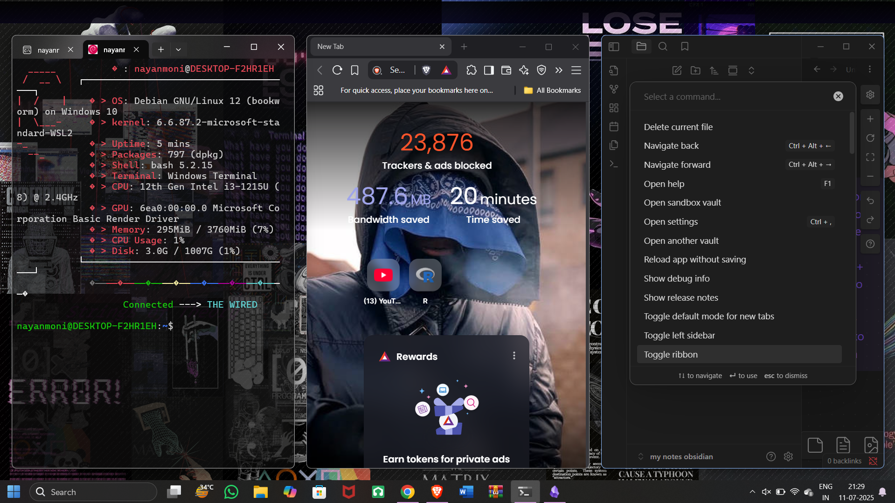
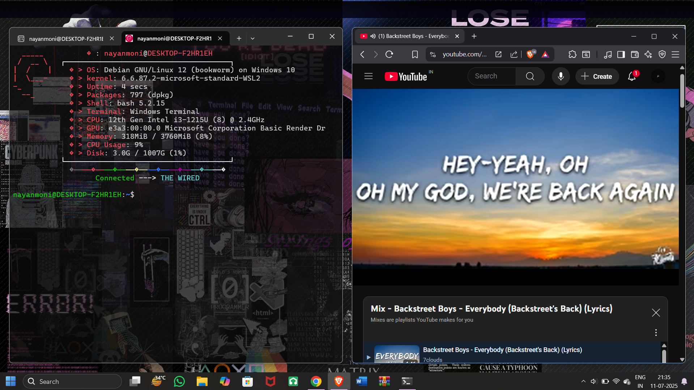
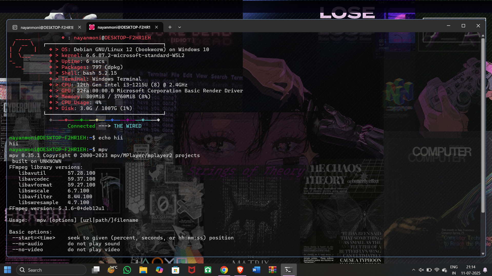
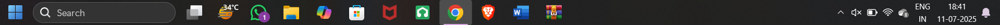

# dot-files-windows
all custome configs -->windows 11(23H2){wsl 2 with debian 12} with glazewm 

  

  

# Dotfiles

My setup consists of:

- [wsl 2](https://github.com/microsoft/WSL2-Linux-Kernel)
- [glazewm](https://github.com/glzr-io/glazewm) 
- [polybar](https://github.com/polybar/polybar)
- [taskbar](https://www.startallback.com)
- [chocolaty ](https://github.com/chocolatey/choco)
- [Neovim](https://neovim.io/) + [vim-plug](https://github.com/junegunn/vim-plug)

  # Terminal
- i use the  wsl 2 terminal for my works (with a custom config for neofetch) i rarly use windows powershell or cmd line
- i use background image opacity around 8% and overall background opacity around 45%
- https://github.com/microsoft/WSL2-Linux-Kernel
- 

  

  # tiling manager
  - glazewm with a little customization of edeges but till now mainly defaults i used
  - (https://github.com/glzr-io/glazewm)
    
   # Taskbar
  - [starallblack](https://www.startallback.com){i use star all black with windows 11 options)
    
  - 

  

# chocolaty
- package manager only use for downloading windows compitable apis
- https://github.com/chocolatey/choco
- otherwise use sudo
# Neovim
- https://neovim.io/
- ## vim pluggins
- https://github.com/junegunn/vim-plug

# Extras
- wallpapers
- 

  

  

